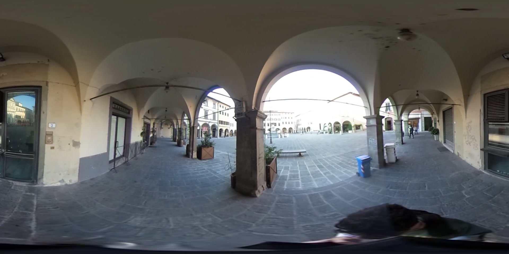

# 3D Environments Reconstruction Using 360° Videos

This repository contains all the source code I wrote for my master thesis, in particular, it contains the MATLAB scripts of my SfM and Dense Point Cloud Reconstruction Pipeline for equirectangular video sequences (produced with a Ricoh Theta S, a full-spherical panoramic camera).

The pipeline is composed of two steps: camera motion estimation and dense reconstruction. For the first step, it estimates the essential matrix for each image pairs and decomposes it to obtain the position of the camera in the second view according to the first view. The complete trajectory is the results of the composition of the local movement for each image pair. Drift is reduced with a windowed bundle adjustment.

The second phase creates a dense point cloud using disparity maps: the pipeline selects image pairs and computes the disparity maps with our adaptive block-matching algorithm.

For more details on how this pipeline works, see [my thesis](https://github.com/bbeco/matlab_tools/raw/master/thesis.pdf).

## Abstract
360° degrees or full spherical images are gaining a huge interest in different fields such as autonomous driving, cinematography, augmented reality (AR), and virtual reality (VR).

Computer vision research addressing spherical images is less popular than the one that considers traditional perspective cameras. This new kind of devices have some advantages with respect to standard cameras, for example, it allows users to capture an entire environment in a single shot.

In this work, we developed a structure from motion (SfM) pipeline for full spherical cameras composed of two main parts: camera poses estimation and dense point cloud reconstruction. This pipeline employs frames captured using a 360° video-camera in the equirectangular format.

Our contribution includes a visual-based frame filter that selects frames to be used for motion estimation, a novel SfM pipeline implementation in MATLAB, and an adaptive window matching 
procedure for point cloud densification.

We tested the performance of our work both with synthetic 3D scenes and with real sequences captured with a Ricoh Theta S camera.

## Our Contribution
Our contribution includes:
* a simple but effective frame filter that selects the non-redundant frames to
be processed based on visual information only;
* a new approach to estimate poses that exploits both frontal and rear points;
* a novel block-matching algorithm for disparity map estimation for equirect-
angular images.

## Demo
This repository contains a real-world video sequence and a demo script to
re-create the dense cloud at the beginning of this document.

If you find any problem running the demo code, please let me know; any feedback is appreciated, of course.

### What you need
To run the demo script, you need a Matlab version that includes the following
toolbox:
* Computer Vision System Toolbox
* Image Processing Toolbox
* Robotics System Toolbox
* Parallel Computing Toolbox

### How to run the demo
Once you have downloaded the repository in a folder called `sfm`, open Matlab and set the current working folder to `sfm/demos`. Then execute
the script called `demo1.m`.
The script will analyze a subset of the images provided with this
repository and recreate the camera trajectory and both the dense and sparse point clouds.
The execution time depends on the specific machine and it takes about 3 hours on a 2.3GHz quad-core Intel processor with 12GB of RAM.
If you want to speed up the computation by analyzing few images, you can
change the `lastFrame` variable in `demo1.m` to a smaller value (like 450).

### How to read the results
The results are stored under `sfm/results`. In particular the following files are created:
* `realSeqSfmTest/test23/sparse.ply`: the triangulated keypoints used in the camera trajectory estimation step;
* `realSeqSfmTest/test23/ps*/camera.ply`: the estimated camera's location;
* `realSeqSfmTest/test23/ps*/total_points*.ply`: the dense point cloud.

In order to open a `ply` file, consider using [MeshLab](http://www.meshlab.net).

### How to re-run the demo
Since the demo script takes so long to complete, it saves its status from time to time so that we can resume the computation in case of power failure.
If you want to re-run the script with the same parameters, you need to delete or rename the `.mat` files in the results folder or the entire folder itself.
